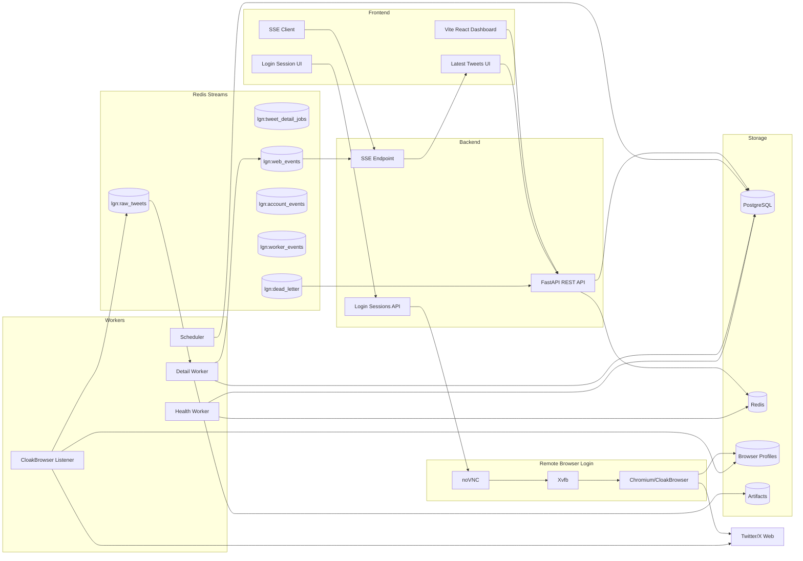
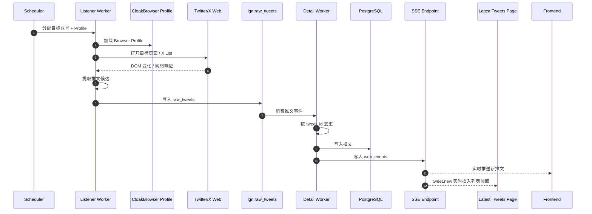
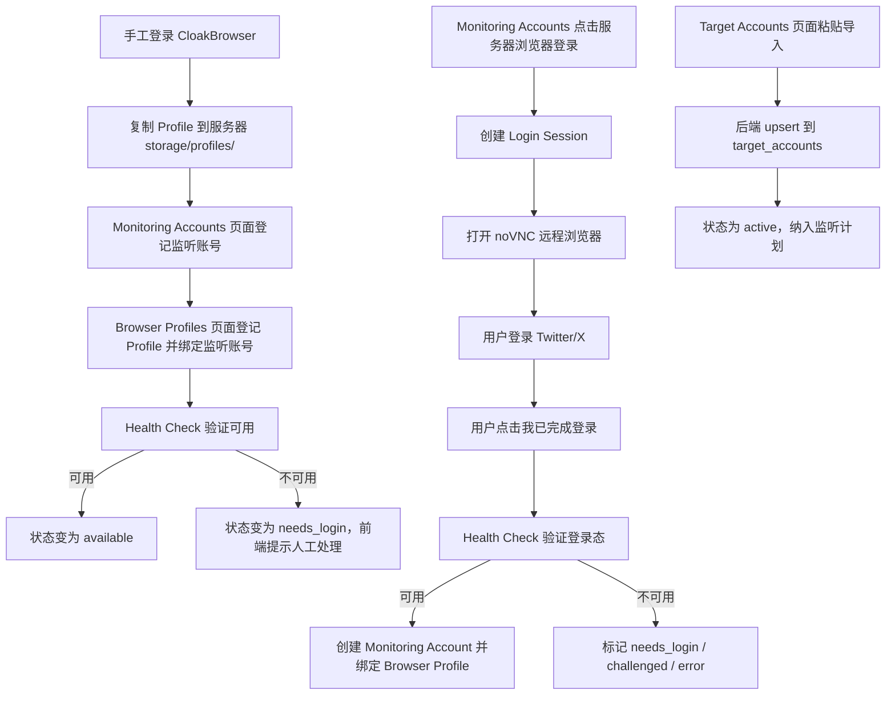
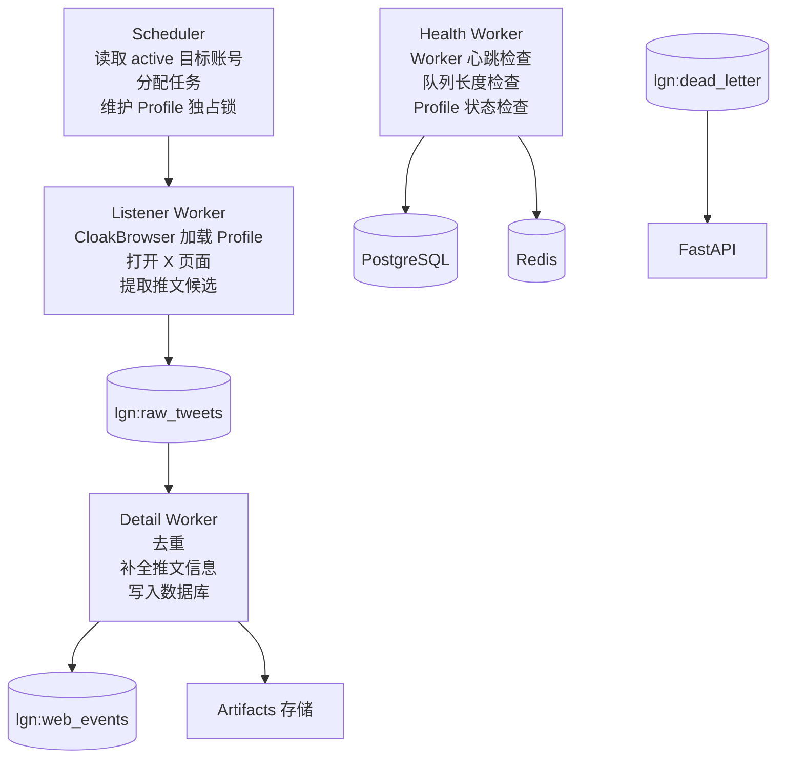
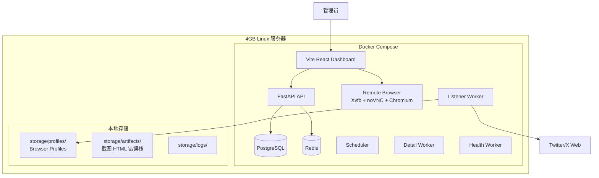

# LittleGankNews 架构图

## 1. 总体架构

## 2. Listener Worker 数据流

## 3. 账号与 Profile 工作流

服务器浏览器登录是 Phase 2B 目标能力。MVP 同一时间只允许 1 个 login session，noVNC 必须通过短期 token 和受保护反向代理访问，禁止裸露 VNC 或 Chrome remote debugging 端口。

## 4. Worker 架构

## 5. 部署拓扑

## 6. 核心模块职责

| 模块 | 职责 | 关键点 |
|------|------|--------|
| FastAPI API | REST API + SSE，账号/Profile/推文管理 | CRUD + 批量导入 + SSE 推送 |
| Latest Tweets UI | 展示最新入库推文 | `/tweets` 页面，SSE `tweet.new` 实时插入 |
| Login Sessions API | 创建服务器远程浏览器登录会话 | noVNC 短期 token、完成/取消、状态事件 |
| Remote Browser | 提供服务器侧可交互浏览器 | Xvfb + noVNC + Chromium/CloakBrowser，MVP 单会话 |
| Scheduler | 读取配置，给 Listener 分配任务 | Profile 独占锁、过期任务检查 |
| Listener Worker | CloakBrowser 加载 Profile，打开 X 页面，提取推文 | DOM 监听、网络响应捕获、登录失效检测 |
| Detail Worker | 消费 raw_tweets，去重，补全信息，入库 | tweet_id 去重 + 数据库唯一约束 |
| Health Worker | Worker 心跳检查、队列长度检查、Profile 状态检查 | 标记离线 Worker、卡死 Profile |
| Redis Streams | 解耦采集、处理、通知 | Consumer group + ACK + dead letter |
| PostgreSQL | 推文、账号、配置、心跳持久化 | Alembic 迁移、唯一约束去重 |
| Artifacts | 保存截图、HTML、raw payload、错误栈 | 保留天数限制、不提交 git |

## 7. Redis Streams 规划

| Stream | 用途 | 生产者 | 消费者 |
|--------|------|--------|--------|
| `lgn:raw_tweets` | Listener 产生的新推文候选 | Listener | Detail Worker |
| `lgn:tweet_detail_jobs` | 详情补全任务 | Scheduler | Detail Worker |
| `lgn:web_events` | 前端 SSE 事件 | Detail Worker | SSE Endpoint |
| `lgn:account_events` | 登录态、账号异常事件 | Listener/Health | API/前端 |
| `lgn:worker_events` | Worker 状态事件 | All Workers | Health Worker |
| `lgn:dead_letter` | 多次失败后的死信 | All Consumers | API/前端 |

处理原则：

- Consumer group 消费。
- 数据库唯一约束作为最终去重保护。
- 成功入库后再 `XACK`。
- 多次失败进入 dead letter。
- Pending 消息后续支持 reclaim。

## 8. 数据库核心表

| 表 | 用途 |
|---|---|
| `target_accounts` | 被监控 Twitter/X 目标账号 |
| `target_account_import_batches` | 批量导入记录 |
| `monitoring_accounts` | 用于登录监听的 Twitter/X 账号 |
| `browser_profiles` | CloakBrowser Profile 元数据 |
| `login_sessions` | 服务器远程浏览器登录会话，保存 noVNC 登录流程状态 |
| `monitor_lists` | Twitter/X List 或内部监听集合 |
| `monitor_list_memberships` | 目标账号与 List 映射 |
| `tweets` | 推文主表 |
| `tweet_media` | 图片、视频、链接等媒体 |
| `tweet_metric_snapshots` | 点赞、转发、回复等指标快照 |
| `worker_heartbeats` | Worker 心跳 |
| `crawl_jobs` | 监听、详情、检查任务 |
| `artifacts` | 截图、HTML、raw payload、错误栈 |
| `web_events` | Web 实时事件记录 |
| `notification_channels` | 通知渠道预留 |
| `alert_rules` | 告警规则预留 |
| `alert_events` | 告警事件预留 |

---

## 变更记录

| 版本 | 日期 | 变更内容 | 作者 |
|------|------|---------|------|
| v1.0 | 2026-06-13 | 初始版本（X API + snscrape 方案） | - |
| v2.0 | 2026-06-13 | 全面改为 CloakBrowser 浏览器监听架构，移除 X API / snscrape 路线，对齐 V1 实施计划 | - |
| v2.1 | 2026-06-13 | 补充 Phase 2B 服务器远程浏览器登录架构，使用 noVNC 登录会话生成 Browser Profile | - |
| v2.2 | 2026-06-13 | 明确 Latest Tweets 页面和 Tweets API 为推文展示入口，SSE `tweet.new` 实时插入 | - |
