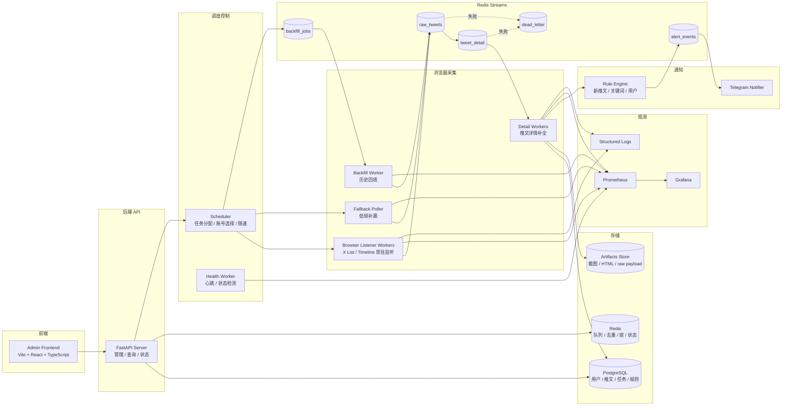
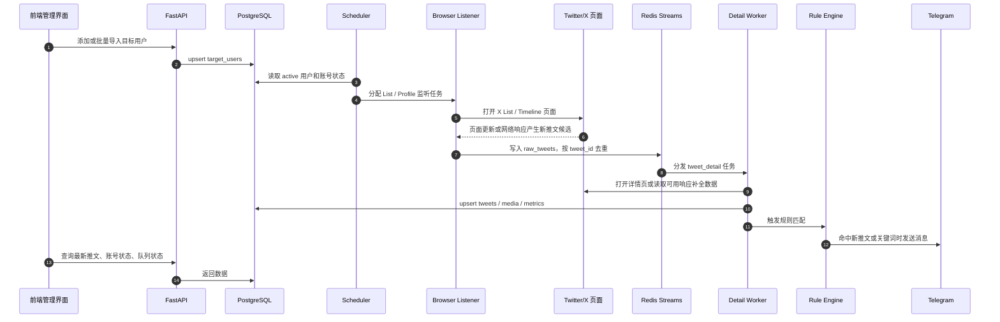

# Twitter/X 浏览器监听监控系统实施计划

日期：2026-06-13

状态：计划中

相关文档：

- [需求文档](../requirements.md)
- [现有架构图](../architecture.md)

## 1. 项目结论

本计划定义 LittleGankNews 的 Twitter/X 公开用户监控系统第一版落地方案。

已确认的产品和技术决策：

- 舍弃 X API 方案，不再把 X API v2 作为主链路或备用链路。
- 主链路使用 CloakBrowser / Playwright 持久化浏览器 Profile 监听 Twitter/X 页面。
- 目标监控约 500 个公开 Twitter/X 用户的新推文。
- 第一版目标是尽量快发现新推文，并尽量让所有被监控账户采用一致策略。
- 第一版先不做复杂 S/A/B 用户分层，后续根据实测延迟、账号稳定性和资源压力再调整。
- 第一版告警渠道只做 Telegram。
- 第一版包含前端管理界面，用于管理目标用户、查看最新推文、任务状态、账号状态和错误证据。

本方案的核心目标不是承诺官方实时流级别 SLA，而是在无 X API 的前提下，构建一套可观测、可恢复、可补漏、可逐步扩容的浏览器监听系统。

## 2. 硬性边界

### 2.1 采集边界

- 只监控公开 Twitter/X 内容。
- 不采集非公开账号、私信、受限内容或需要越权访问的内容。
- 不绕过验证码。
- 不破解或规避平台风控。
- 不做高频暴力刷新。
- 不承诺 500 个用户全部稳定小于 1 分钟发现。

### 2.2 安全边界

- Cookie、Authorization header、账号密码、Telegram Bot Token 不得写入普通日志。
- 账号登录态只能存放在受控的 CloakBrowser Profile 或加密配置中。
- `.env`、Profile 数据、截图和 raw payload 不应提交到 git。
- 生产环境必须区分只读查看权限和管理权限。

### 2.3 运维边界

- 页面结构变化、登录态失效、账号风控、验证码挑战必须被系统检测并标记为需要人工处理。
- Worker 崩溃后必须可重启，队列消息不能静默丢失。
- 解析失败必须保留 artifacts，包括截图、HTML 片段、URL、错误栈和必要的脱敏 raw payload。

## 3. 协作守则

本项目执行以下协作规范，参考用户提供的 CLAUDE.md / UDE.md 守则整理。

### 3.1 需求不清不写码

任何不明确的问题必须先提出并与用户确认。不得在功能边界、用户角色、数据形态、API 对接方式、验收标准不清晰时擅自假设并进入实现。

### 3.2 文档先行

任何需求变更或功能变更必须按顺序执行：

1. 确认变更边界。
2. 调整对应文档。
3. 修改代码。
4. 同步测试。

文档进度与代码进度不一致时，先补齐文档再继续下一个任务。

### 3.3 文档组织

- 根目录保留项目入口和必要配置说明。
- 项目文档放入 `docs/`。
- 实施计划放入 `docs/plans/`。
- `docs/README.md` 作为文档总索引，新增、删除、重命名文档时同步更新。

### 3.4 原子化变更

启用 git 后，每次变更应保持单一目的、可独立 review、可独立回滚。提交信息说明为什么变更，而不是只写做了什么。

## 4. 推荐技术栈

| 层级 | 技术 | 用途 | 选择原因 |
|---|---|---|---|
| 前端管理界面 | Vite + React + TypeScript | Dashboard、用户管理、推文流、任务状态 | Vite 是现代前端构建工具，适合快速搭建开发环境 |
| 后端 API | Python + FastAPI | 管理 API、查询 API、状态 API | FastAPI 适合快速实现 Python API，并自带 OpenAPI/Swagger 文档 |
| 浏览器执行层 | CloakBrowser + Playwright | 控制持久化浏览器 Profile，监听 X 页面 | Playwright 支持 Chromium 自动化和浏览器上下文控制 |
| 队列 | Redis Streams | 任务队列、事件流、重试、去重状态 | Redis Streams 适合轻量队列和消费组 |
| 数据库 | PostgreSQL | 用户、推文、媒体、任务、账号、规则持久化 | 关系模型清晰，支持事务和唯一约束 |
| 全文检索 MVP | PostgreSQL Full Text Search | 关键词搜索 | 先降低系统复杂度，后续再评估 Elasticsearch / OpenSearch |
| 告警 | Telegram Bot API | 新推文和规则命中通知 | Bot API 是 HTTPS 接口，集成成本低 |
| 监控 | Prometheus + Grafana | 指标、延迟、队列、Worker 健康 | 标准监控组合 |
| 部署 | Docker Compose | 本地和单机部署 | 适合 MVP 和 PoC 快速落地 |
| 错误证据 | 本地目录 / MinIO / S3 | 截图、HTML、raw payload、日志归档 | 便于排查页面结构变化和解析失败 |

参考资料：

- [Playwright Browsers](https://playwright.dev/docs/browsers)
- [FastAPI](https://fastapi.tiangolo.com/)
- [Telegram Bot API](https://core.telegram.org/bots/api)
- [PostgreSQL Full Text Search](https://www.postgresql.org/docs/current/textsearch.html)
- [Vite Guide](https://vite.dev/guide/)

## 5. 总体架构



## 6. 实时数据流



## 7. 账号与 List 策略

### 7.1 第一版策略

- 500 个目标用户拆分到多个 X List。
- 第一版尽量所有用户采用一致监听策略。
- 不在第一版区分 S/A/B 优先级，避免调度复杂度过早上升。
- 每个 Twitter/X 账号绑定一个 CloakBrowser Profile。
- 每个 Browser Worker 同时控制有限数量 Profile，避免单进程资源过高。
- Scheduler 根据账号状态、Worker 心跳、队列压力分配任务。

### 7.2 建议初始容量

| 项 | 建议值 | 说明 |
|---|---:|---|
| 目标用户 | 500 | 全部为公开账号 |
| X List | 10-20 | 控制单 List 规模，降低漏抓和页面压力 |
| 监控账号 | 8-12 | 分散登录态和浏览器负载 |
| Listener Worker | 4-8 | 视服务器资源调整 |
| Detail Worker | 4-12 | 可水平扩展 |
| Fallback Poller | 1-3 | 低频补漏，不抢实时资源 |

### 7.3 后续分层策略

当第一版稳定后，可引入分层：

- S 级：重点用户，更频繁监听和详情补全。
- A 级：普通活跃用户，标准监听策略。
- B 级：低频用户，降低补漏频率。

引入分层前必须先有实测数据，包括延迟、漏抓、账号异常、队列积压和资源占用。

## 8. 前端管理界面范围

第一版前端管理界面必须支持以下模块。

| 模块 | 功能 |
|---|---|
| Dashboard | 显示目标用户数量、今日新推文、Telegram 告警数、队列堆积、Worker 在线数、账号异常数 |
| Target Users | 新增、批量导入、暂停、恢复、删除、按 username 搜索 |
| Latest Tweets | 查看最新推文流，支持按用户、时间、关键词过滤 |
| Alert Rules | 配置新推文告警、关键词告警、Telegram chat id、测试发送 |
| Accounts | 查看 Twitter/X 账号、CloakBrowser Profile、登录态、风控状态 |
| Jobs | 查看 listener、detail、fallback、backfill 任务状态 |
| Artifacts | 查看解析失败、登录失效、页面异常对应的截图和错误证据 |
| System Health | 查看 API、Redis、PostgreSQL、Telegram、Worker 心跳 |

第一版不做复杂多租户，不做细粒度 RBAC。若部署到公网，至少需要登录保护和管理接口鉴权。

## 9. API 设计

### 9.1 系统接口

| 方法 | 路径 | 用途 |
|---|---|---|
| GET | `/api/v1/health` | API 健康检查 |
| GET | `/api/v1/dashboard/summary` | Dashboard 汇总 |
| GET | `/api/v1/system/workers` | Worker 心跳和状态 |
| GET | `/api/v1/system/queues` | Redis Stream 堆积状态 |

### 9.2 目标用户接口

| 方法 | 路径 | 用途 |
|---|---|---|
| GET | `/api/v1/target-users` | 目标用户列表 |
| POST | `/api/v1/target-users` | 新增目标用户 |
| POST | `/api/v1/target-users/batch` | 批量导入目标用户 |
| PATCH | `/api/v1/target-users/{id}` | 修改状态、标签、备注 |
| DELETE | `/api/v1/target-users/{id}` | 删除或软删除目标用户 |
| POST | `/api/v1/target-users/{id}/check-now` | 立即检查 |

### 9.3 推文接口

| 方法 | 路径 | 用途 |
|---|---|---|
| GET | `/api/v1/tweets/latest` | 最新推文 |
| GET | `/api/v1/users/{username}/tweets` | 指定用户推文 |
| GET | `/api/v1/tweets/{tweet_id}` | 推文详情 |
| POST | `/api/v1/tweets/search` | 按关键词、用户、时间搜索 |

### 9.4 告警接口

| 方法 | 路径 | 用途 |
|---|---|---|
| GET | `/api/v1/alert-rules` | 告警规则列表 |
| POST | `/api/v1/alert-rules` | 创建规则 |
| PATCH | `/api/v1/alert-rules/{id}` | 修改规则 |
| DELETE | `/api/v1/alert-rules/{id}` | 删除规则 |
| POST | `/api/v1/telegram/test` | 测试 Telegram 发送 |

### 9.5 任务和账号接口

| 方法 | 路径 | 用途 |
|---|---|---|
| GET | `/api/v1/accounts` | 账号和 Profile 列表 |
| PATCH | `/api/v1/accounts/{id}` | 修改账号状态 |
| GET | `/api/v1/jobs` | 任务列表 |
| POST | `/api/v1/jobs/backfill` | 创建历史回填任务 |
| GET | `/api/v1/artifacts` | 错误证据列表 |

## 10. 数据库设计

### 10.1 核心表

| 表 | 用途 |
|---|---|
| `target_users` | 被监控 Twitter/X 用户 |
| `twitter_accounts` | 监控账号状态，不存明文密码 |
| `browser_profiles` | CloakBrowser Profile 绑定和状态 |
| `monitor_lists` | X List 配置 |
| `list_memberships` | 目标用户和 List 的映射 |
| `tweets` | 标准化推文主表 |
| `tweet_media` | 图片、视频、外链等媒体信息 |
| `tweet_metrics_snapshots` | 点赞、转发、评论等指标快照 |
| `alert_rules` | Telegram 告警规则 |
| `alert_events` | 告警事件和发送状态 |
| `telegram_channels` | Telegram chat/channel 配置 |
| `crawl_jobs` | 监听、详情、补漏、回填任务 |
| `crawl_runs` | 单次任务执行记录 |
| `worker_heartbeats` | Worker 心跳 |
| `artifacts` | 错误截图、HTML、raw payload 引用 |
| `dedup_events` | 去重记录和幂等辅助 |

### 10.2 关键唯一约束

```sql
UNIQUE (platform, username)      -- target_users
UNIQUE (platform, tweet_id)      -- tweets
UNIQUE (list_id, target_user_id) -- list_memberships
```

### 10.3 推文标准字段

推文表至少包含：

- `tweet_id`
- `author_username`
- `author_display_name`
- `text`
- `created_at_remote`
- `first_seen_at`
- `detail_completed_at`
- `url`
- `like_count`
- `retweet_count`
- `reply_count`
- `quote_count`
- `source`
- `source_account_id`
- `source_list_id`
- `raw_json_ref`
- `status`

## 11. Worker 设计

| Worker | 职责 |
|---|---|
| `scheduler` | 读取目标用户、账号、List 和队列状态，分配监听和补漏任务 |
| `listener_worker` | 常驻打开 X List / Timeline 页面，捕获新推文候选 |
| `detail_worker` | 打开详情页或读取可用响应，补全文本、媒体、互动指标 |
| `fallback_poller` | 低频扫描用户主页或 List，修复漏抓 |
| `backfill_worker` | 按需做历史回填，支持暂停、恢复和 partial 标记 |
| `telegram_notifier` | 消费告警事件并发送 Telegram 消息 |
| `health_worker` | 记录 Worker 心跳、账号状态、Profile 状态和队列健康 |

## 12. Redis Streams 设计

| Stream | 用途 |
|---|---|
| `raw_tweets` | Listener / Poller / Backfill 产生的新推文候选 |
| `tweet_detail` | 需要详情补全的推文任务 |
| `backfill_jobs` | 历史回填任务 |
| `alert_events` | 待发送 Telegram 的告警事件 |
| `account_health` | 账号状态检查事件 |
| `dead_letter` | 多次失败后的死信 |

每个 Stream 使用 consumer group，消息处理必须幂等。推文入库以 `tweet_id` 唯一约束作为最终去重保护。

## 13. Telegram 告警

### 13.1 第一版规则

- 新推文告警。
- 指定关键词命中告警。
- 指定用户命中告警。
- Telegram 测试发送。

### 13.2 消息内容

Telegram 消息至少包含：

- 作者用户名。
- 推文正文摘要。
- 推文链接。
- 发现时间。
- 远端发布时间。
- 发现延迟。
- 命中的规则名。

### 13.3 失败处理

- 发送失败进入重试。
- 多次失败后进入 dead letter。
- 保存 `telegram_message_id`、响应状态和错误信息。
- Bot Token 不允许进入普通日志。

## 14. 实施阶段

### Phase 0：文档确认和环境准备

交付物：

- 本计划文档。
- `docs/README.md` 文档索引。
- `.env.example` 草案。
- Docker Compose 草案。

验收标准：

- 用户确认边界、技术栈、Telegram 优先级和前端范围。
- 明确不使用 X API。
- 明确第一版所有账号尽量一致策略。

### Phase 1：10-20 用户 PoC

交付物：

- FastAPI 基础服务。
- PostgreSQL 初始 schema。
- Redis Streams 初始化。
- 1 个 listener worker。
- 1 个 detail worker。
- 1 个 Telegram notifier。
- 简单前端 Dashboard。

验收标准：

- 10-20 个公开用户可添加和管理。
- 至少 1 个 X List 可被监听。
- 新推文可写入 PostgreSQL。
- 重复 tweet 不重复入库。
- Telegram 可发送新推文告警。
- 前端可查看最新推文、用户列表和 worker 状态。
- 连续运行 72 小时并记录 P50/P95/P99 延迟。

### Phase 2：100 用户 MVP

交付物：

- 批量导入目标用户。
- 多账号 / 多 Profile 监听。
- Fallback Poller。
- Artifacts 保存和查看。
- Alert Rules 管理。
- Jobs 页面。

验收标准：

- 100 个公开用户稳定运行。
- Telegram 规则可配置和测试。
- 登录态失效、解析失败、账号异常可在前端看到。
- Redis 队列无长期堆积。
- Worker 崩溃后可恢复。

### Phase 3：500 用户扩容

交付物：

- 10-20 个 List 的用户分配策略。
- 8-12 个账号/Profile 管理。
- 多 Listener Worker 并行。
- 指标监控和 Grafana Dashboard。
- 数据库索引和查询优化。

验收标准：

- 500 个公开用户均纳入监控计划。
- 所有用户采用一致策略运行，并记录实际延迟分布。
- 新推文发现、详情补全、Telegram 告警形成闭环。
- parser failure rate、账号异常数、队列积压可监控。

### Phase 4：前端管理台完善

交付物：

- Target Users 完整 CRUD。
- Latest Tweets 搜索与过滤。
- Accounts/Profile 状态页。
- Artifacts 详情页。
- Telegram Rules 管理页。
- 基础登录保护。

验收标准：

- 常见运维动作无需直接操作数据库。
- 账号异常和解析失败可从前端定位。
- 管理接口有基本鉴权。

### Phase 5：稳定性和策略优化

交付物：

- S/A/B 分层策略评估。
- Worker 定期重启机制。
- 数据归档策略。
- 更细的告警抑制和频率控制。
- 可选 Elasticsearch / OpenSearch 评估。

验收标准：

- 基于 Phase 3 实测数据决定是否分层。
- 系统可连续运行一周以上。
- 数据增长、队列积压、账号异常有明确处理策略。

## 15. 验收指标

| 指标 | PoC 目标 | 500 用户目标 |
|---|---:|---:|
| 目标用户数量 | 10-20 | 500 |
| 连续运行时间 | 72 小时 | 7 天 |
| 重复入库 | 0 个关键重复 | 0 个关键重复 |
| Telegram 可用性 | 可测试发送 | 告警事件可追踪 |
| Worker 心跳 | 可查看 | 可告警 |
| 解析失败 artifact | 可保存 | 可检索 |
| 延迟指标 | P50/P95/P99 可记录 | P50/P95/P99 可监控 |
| 队列堆积 | 可查看 | 无长期不可恢复堆积 |

## 16. 风险与应对

| 风险 | 影响 | 应对 |
|---|---|---|
| X 页面结构变化 | 解析失败或漏抓 | parser 版本化，保存截图、HTML 和 raw payload |
| X List 漏抓 | 新推文延迟或丢失 | fallback poller 低频补漏 |
| 账号登录态失效 | Listener 停止工作 | 标记 `needs_login`，前端提示人工处理 |
| 账号风控或验证码 | 采集能力下降 | 账号状态机、熔断、人工介入 |
| 浏览器内存增长 | Worker 不稳定 | 定期重启 Profile / Worker，监控内存 |
| Redis 队列堆积 | 告警延迟上升 | 增加 worker，限流，拆分高低优先级队列 |
| Telegram 发送失败 | 告警丢失 | 重试、dead letter、发送状态记录 |
| PostgreSQL 查询变慢 | 前端和 API 变慢 | 索引、分区、归档，必要时加搜索引擎 |
| 第一版所有账户一致策略压力过高 | 资源浪费或延迟变差 | 基于实测进入 S/A/B 分层 |

## 17. 待确认事项

- CloakBrowser 的具体启动方式和 Playwright 连接方式。
- Twitter/X 监控账号数量、来源、是否可长期使用。
- Telegram bot token 和 chat id 的配置方式。
- 前端是否只供内部使用，是否需要登录。
- 部署环境 CPU、内存、磁盘和网络条件。
- artifacts 保存位置使用本地目录、MinIO 还是云对象存储。

## 18. 下一步

建议下一步按以下顺序推进：

1. 用户确认本计划。
2. 新增或更新需求文档，明确“舍弃 X API，以浏览器监听为主链路”。
3. 新增工程骨架和 `.env.example`。
4. 实现 Phase 1 PoC。
5. 跑 72 小时，基于数据决定 Phase 2 扩展策略。
